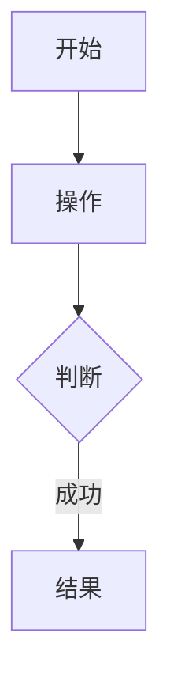
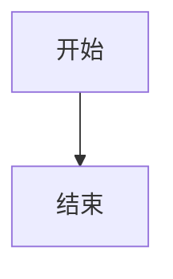

# PRD 模板格式规范说明

## 概述

本文档详细说明了 PRD 模板的格式规范，确保所有生成的 PRD 文档保持一致性和规范性。

## 主 PRD 模板格式规范

### 模板文件
`templates/main_prd_template.md`

### 章节结构（共 9 个章节）

```
1. 文档基础信息
   - 文档名称、作者、创建时间、当前版本、变更日志
   - 1.1 变更日志（表格）

2. 项目背景与目标
   - 2.1 背景说明
   - 2.2 产品目标

3. 核心业务流程
   - 3.1 业务流程概述
   - 3.2 业务流程图（Mermaid）

4. 功能模块清单
   - 4.1 模块列表（表格）
   - 4.2 模块关系图（Mermaid）

5. 用户故事概述
   - 5.1 用户角色与权限（表格）
   - 5.2 高层用户故事

6. 非功能需求（表格）

7. 项目级验收标准
   - 7.1 功能验收
   - 7.2 性能验收
   - 7.3 业务目标验收

8. 项目计划与里程碑
   - 8.1 模块依赖与开发顺序（表格）
   - 8.2 三方系统集成（表格）
   - 8.3 里程碑（表格）

9. 附录
   - 9.1 术语定义（表格）
   - 9.2 参考资料
```

### 格式要求

#### 1. 文档头部
```markdown
# {{PROJECT_NAME}} 产品需求文档 (PRD)

> **模板版本:** 1.0
> **生成时间:** {{DATE}}
> **状态:** {{STATUS}}
> **版本:** v{{VERSION}}
```

#### 2. 目录
```markdown
## 目录

1. [文档基础信息](#1-文档基础信息)
2. [项目背景与目标](#2-项目背景与目标)
...
```

#### 3. 表格格式
```markdown
| 字段 | 内容 |
| --- | --- |
| 文档名称 | {{PROJECT_NAME}} 产品需求文档 |
| 作者 | {{AUTHOR}} |
```

#### 4. Mermaid 图表格式
```markdown

```

### 变量说明

| 变量名 | 说明 | 示例 |
| --- | --- | --- |
| {{PROJECT_NAME}} | 项目名称 | 电商平台 |
| {{DATE}} | 生成日期 | 2024-01-15 |
| {{AUTHOR}} | 作者 | 张三 |
| {{VERSION}} | 版本号 | 1.0 |
| {{STATUS}} | 状态 | 未评审/已评审 |

## 模块 PRD 模板格式规范

### 模板文件
`templates/module_prd_template.md`

### 章节结构（共 11 个章节）

```
1. 文档基础信息
   - 文档名称、作者、创建时间、当前版本、变更日志
   - 1.1 变更日志（表格）

2. 模块背景与目标
   - 2.1 模块背景
   - 2.2 模块目标

3. 详细功能需求
   - 3.1 功能清单（表格）
   - 3.2 功能流程图（Mermaid）
   - 3.3 功能详细说明
   - 3.4 模块角色与权限（表格）

4. 用户故事详述
   - US-1, US-2, ...（详细格式）

5. 用户界面设计
   - 5.1 核心屏幕和视图
   - 5.2 页面流程图（Mermaid）
   - 5.3 页面说明与交互细节
   - 界面布局图（ASCII）

6. 业务规则与边界条件
   - 业务规则表格
   - 6.1 边界条件

7. 与其他模块的集成
   - 7.1 集成关系（表格）
   - 7.2 集成流程图（Mermaid）

8. 异常与错误处理
   - 8.1 错误状态流转图（Mermaid）
   - 8.2 错误码表（表格）

9. 埋点与数据指标（表格）

10. 模块级验收标准
    - 10.1 功能验收
    - 10.2 界面验收
    - 10.3 集成验收

11. 附录
    - 11.1 术语定义（表格）
    - 11.2 UI 设计图
```

### 格式要求

#### 1. 用户故事格式
```markdown
#### **US-1: [用户故事标题]**
- **作为** [用户角色]
- **我希望** [完成某项操作]
- **以便于** [实现某种价值/解决某个问题]

**前置条件**: [执行此功能需要满足的前提]

**操作流程**: [一步步描述用户成功路径下的操作与系统反馈]

**异常处理**: [各种可能出错的情况及系统行为]

**验收标准**:
- [场景1：期望的系统结果]
- [场景2：期望的系统结果]
```

#### 2. 界面布局图格式
```markdown
```text
+----------------------------------------+
|              页面标题                   |
+----------------------------------------+
|                                        |
|  +--------------+  +----------------+  |
|  |              |  |                |  |
|  |  左侧区域    |  |   右侧区域     |  |
|  |              |  |                |  |
|  +--------------+  +----------------+  |
+----------------------------------------+
```
```

## 格式检查清单

### 生成前检查

- [ ] 确认使用正确的模板文件
- [ ] 准备好所有必需的变量值
- [ ] 了解项目的具体需求

### 生成后检查

#### 结构检查
- [ ] 所有章节都存在
- [ ] 章节顺序正确
- [ ] 章节编号正确
- [ ] 没有遗漏的子章节

#### 格式检查
- [ ] 表格格式正确（表头、分隔线、内容）
- [ ] Mermaid 图表语法正确
- [ ] 标题层级正确（#, ##, ###）
- [ ] 列表格式正确（-, 1.）

#### 内容检查
- [ ] 所有变量都已替换
- [ ] 没有保留 `{{变量名}}` 占位符
- [ ] 内容符合项目实际情况
- [ ] 没有遗漏的关键信息

#### Mermaid 图表检查
- [ ] flowchart 语法正确
- [ ] graph 语法正确
- [ ] stateDiagram-v2 语法正确
- [ ] 节点 ID 没有重复
- [ ] 连接关系正确

## 常见格式错误

### 1. 表格格式错误

**错误示例：**
```markdown
| 字段 | 内容 |
|---|---|
| 文档名称 | 测试 |
```

**正确格式：**
```markdown
| 字段 | 内容 |
| --- | --- |
| 文档名称 | 测试 |
```

### 2. Mermaid 图表错误

**错误示例：**
```markdown

```

**正确格式：**
```markdown

```

### 3. 标题层级错误

**错误示例：**
```markdown
## 1. 文档基础信息
### 文档名称
```

**正确格式：**
```markdown
## 1. 文档基础信息

| 字段 | 内容 |
| --- | --- |
| 文档名称 | {{PROJECT_NAME}} 产品需求文档 |
```

### 4. 变量未替换

**错误示例：**
```markdown
| 作者 | {{AUTHOR}} |
```

**正确格式：**
```markdown
| 作者 | 张三 |
```

## 格式验证工具

### 手动验证步骤

1. **对比模板**：将生成的文档与模板逐章节对比
2. **检查变量**：搜索 `{{` 确认没有未替换的变量
3. **验证图表**：在 Mermaid 编辑器中验证图表语法
4. **检查表格**：确认表格渲染正确

### 自动验证（未来功能）

- 自动检测章节完整性
- 自动检测变量替换
- 自动验证 Mermaid 语法
- 自动检测格式一致性

## 最佳实践

### 1. 生成前
- 仔细阅读模板结构
- 准备完整的项目信息
- 确认模板版本

### 2. 生成时
- 严格按照模板格式
- 保持章节顺序
- 注意格式细节

### 3. 生成后
- 进行格式检查
- 验证内容完整性
- 确认变量替换

### 4. 审核时
- 检查格式规范性
- 验证内容准确性
- 确认符合项目需求

## 总结

遵循本格式规范可以确保：
- PRD 文档的一致性
- 团队协作的效率
- 文档质量的保证
- 后续维护的便利

所有生成的 PRD 文档都必须严格遵循本规范。
