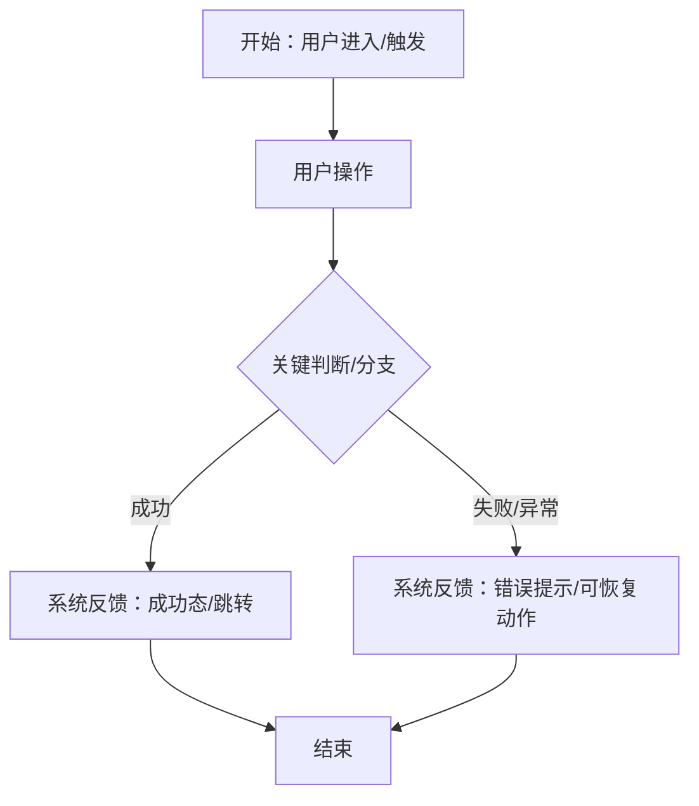
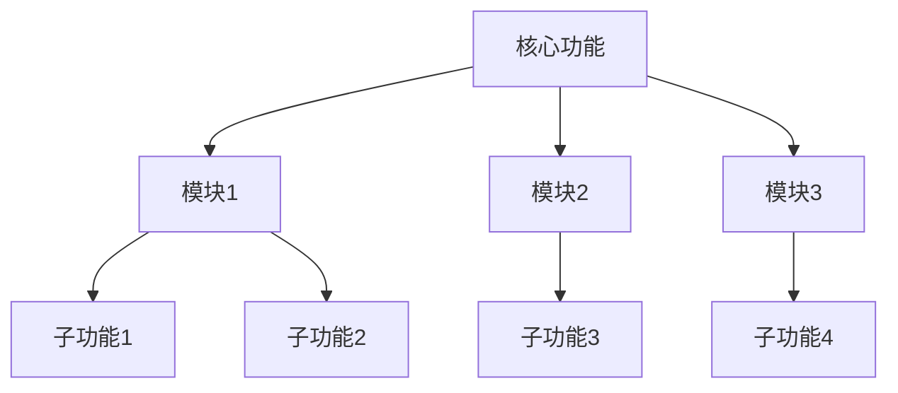

# {{PROJECT_NAME}} 产品需求文档 (PRD)

> **模板版本:** 1.0
> **生成时间:** {{DATE}}
> **状态:** {{STATUS}}
> **版本:** v{{VERSION}}

## 目录

1. [文档基础信息](#1-文档基础信息)
2. [项目背景与目标](#2-项目背景与目标)
3. [核心业务流程](#3-核心业务流程)
4. [功能模块清单](#4-功能模块清单)
5. [用户故事概述](#5-用户故事概述)
6. [非功能需求](#6-非功能需求)
7. [项目级验收标准](#7-项目级验收标准)
8. [项目计划与里程碑](#8-项目计划与里程碑)
9. [附录](#9-附录)

---

## 1. 文档基础信息

| 字段 | 内容 |
| --- | --- |
| 文档名称 | {{PROJECT_NAME}} 产品需求文档 |
| 作者 | {{AUTHOR}} |
| 创建时间 | {{DATE}} |
| 当前版本 | v{{VERSION}} |
| 变更日志 | 见下方章节 |

### 1.1 变更日志

| 日期 | 版本 | 概述 | 作者 |
|------------|------|----------------|--------------|
| {{DATE}} | v{{VERSION}} | 初始版本 | {{AUTHOR}} |
| | | | |

---

## 2. 项目背景与目标

### 2.1 背景说明

{{描述此产品解决的问题及其重要性。包括相关市场背景、用户痛点或证明此计划合理性的业务驱动因素。}}

### 2.2 产品目标

- {{目标 1: 产品实现的主要用户成果}}
- {{目标 2: 次要业务目标}}
- {{目标 3: 其他目标}}

---

## 3. 核心业务流程

### 3.1 业务流程概述

{{描述项目的核心业务流程和用户旅程，从宏观角度说明用户如何与产品交互。}}

### 3.2 业务流程图

> **说明：** 使用 Mermaid 图描述核心业务流程，避免技术实现细节。

---

## 4. 功能模块清单

### 4.1 模块列表（模块划分颗粒度）

> **说明：** 此处为一级模块列表，颗粒度为大结构描述（如用户管理、订单管理等），具体功能清单在模块PRD中体现。

| 编号 | 模块名称 | 描述 | 优先级 | 备注 |
| --- | --- | --- | --- | --- |
| M-01 | {{模块名称}} | {{模块简要描述}} | {{高/中/低}} | {{备注}} |
| M-02 | {{模块名称}} | {{模块简要描述}} | {{高/中/低}} | {{备注}} |
| M-03 | {{模块名称}} | {{模块简要描述}} | {{高/中/低}} | {{备注}} |

### 4.2 模块关系图

> **说明：** 使用Mermaid图展示功能模块之间的关系和依赖。

---

## 5. 用户故事概述

### 5.1 用户角色与权限

> **说明：** 此处列出产品所有涉及的角色及其权限。

| 角色 | 描述 | 权限 |
| --- | --- | --- |
| {{角色1}} | {{角色描述}} | {{权限1、权限2}} |
| {{角色2}} | {{角色描述}} | {{权限1、权限2}} |
| {{角色3}} | {{角色描述}} | {{权限1、权限2}} |

### 5.2 高层用户故事

- **US-1:** 作为 {{用户角色}}，我希望 {{完成某项操作}}，以便于 {{实现某种价值/解决某个问题}}
- **US-2:** 作为 {{用户角色}}，我希望 {{完成某项操作}}，以便于 {{实现某种价值/解决某个问题}}
- **US-3:** 作为 {{用户角色}}，我希望 {{完成某项操作}}，以便于 {{实现某种价值/解决某个问题}}

---

## 6. 非功能需求

| 类型 | 说明 |
| --- | --- |
| 响应时间 | {{页面交互≤Xs，接口响应≤Ys}} |
| 浏览器兼容 | {{Chrome ≥90，Firefox，Safari等}} |
| 安全性 | {{数据加密传输，CSRF防护，XSS过滤等}} |
| 可用性 | {{系统可用性要求，如99.9%}} |
| 其他 | {{其他非功能需求}} |

---

## 7. 项目级验收标准

### 7.1 功能验收

- {{功能1：满足XXX条件算通过}}
- {{功能2：满足XXX条件算通过}}
- {{功能3：满足XXX条件算通过}}

### 7.2 性能验收

- {{响应时间：满足非功能需求}}
- {{稳定性：连续运行X小时无异常}}

### 7.3 业务目标验收

- {{业务目标1：达到XXX指标}}
- {{业务目标2：达到XXX指标}}

---

## 8. 项目计划与里程碑

### 8.1 模块依赖与开发顺序

> **说明：** 先罗列模块清单中模块的依赖关系和开发先后顺序。

| 编号 | 模块名称 | 依赖模块 | 开发顺序 | 备注 |
| --- | --- | --- | --- | --- |
| M-01 | {{模块名称}} | - | 1 | |
| M-02 | {{模块名称}} | {{依赖模块}} | 2 | |
| M-03 | {{模块名称}} | {{依赖模块}} | 3 | |

### 8.2 三方系统集成（如有）

> **说明：** 如有涉及三方系统集成，在此列出。

| 系统名称 | 集成方式 | 用途 | 备注 |
| --- | --- | --- | --- |
| {{系统名称}} | {{API/SDK/数据导入}} | {{用途}} | {{备注}} |

### 8.3 里程碑

> **说明：** 里程碑不需要具体时间，只需列出里程碑名称和交付物。

| 里程碑 | 交付物 | 状态 |
| --- | --- | --- |
| {{里程碑1}} | {{交付物}} | {{未开始/进行中/已完成}} |
| {{里程碑2}} | {{交付物}} | {{未开始/进行中/已完成}} |
| {{里程碑3}} | {{交付物}} | {{未开始/进行中/已完成}} |

---

## 9. 附录

### 9.1 术语定义

| 术语 | 解释 |
| --- | --- |
| {{术语1}} | {{解释}} |
| {{术语2}} | {{解释}} |
| {{术语3}} | {{解释}} |

### 9.2 参考资料

- {{参考资料1：链接或文档名称}}
- {{参考资料2：链接或文档名称}}
- {{参考资料3：链接或文档名称}}
