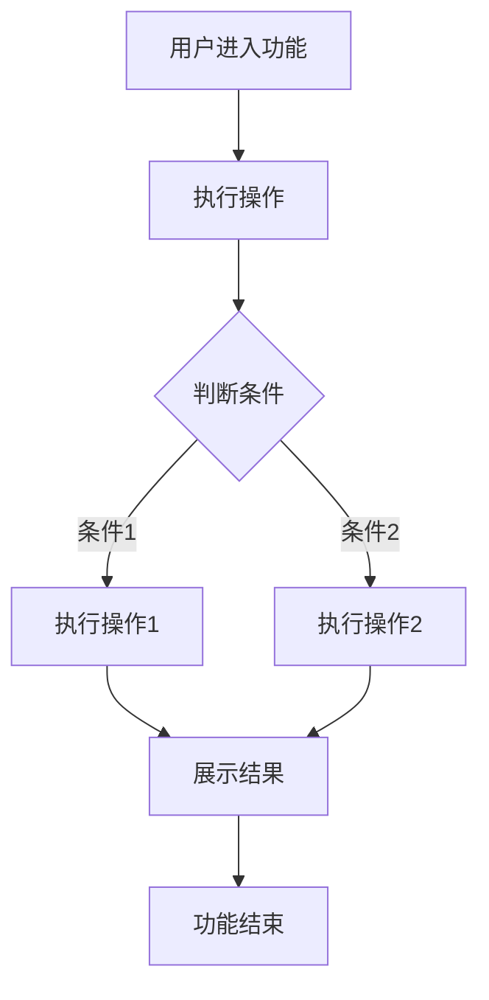
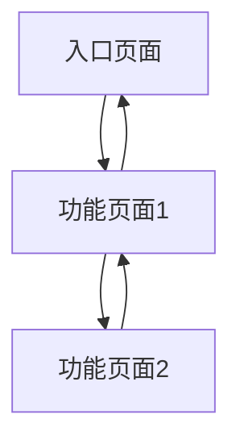
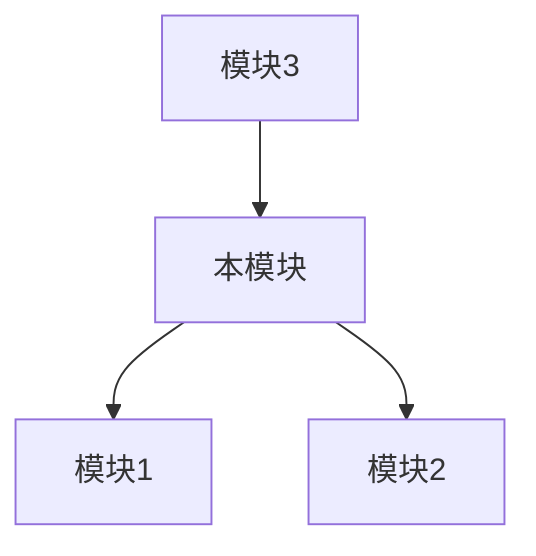
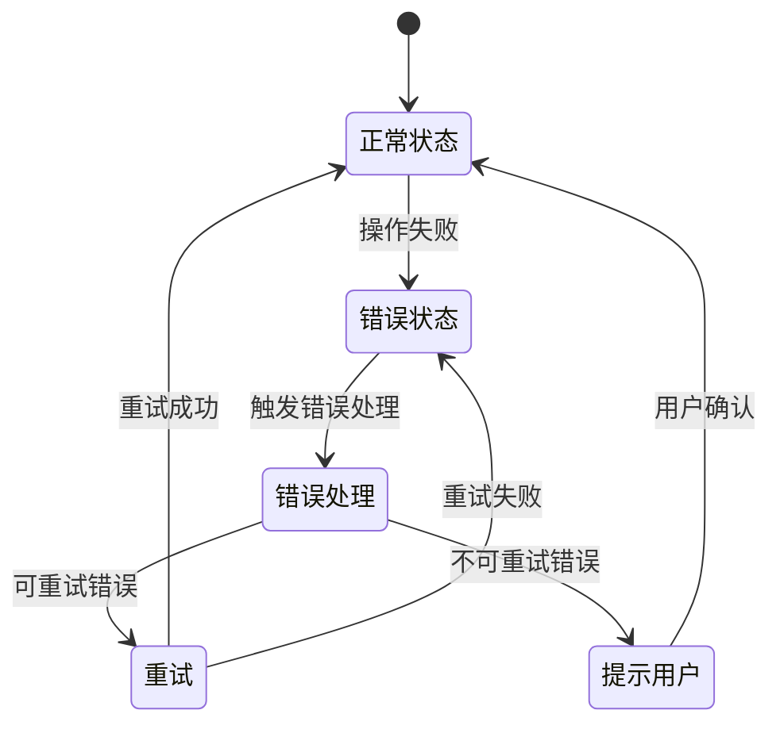

# {{模块名称}} 产品需求文档 (PRD)

> **模板版本:** 1.0
> **生成时间:** {{DATE}}
> **状态:** {{状态：未评审/已评审}}
> **关联主PRD:** {{主PRD名称及版本}}

## 目录

1. [文档基础信息](#1-文档基础信息)
2. [模块背景与目标](#2-模块背景与目标)
3. [详细功能需求](#3-详细功能需求)
4. [数据字段定义](#4-数据字段定义)
5. [用户故事详述](#5-用户故事详述)
6. [用户界面设计](#6-用户界面设计)
7. [业务规则与边界条件](#7-业务规则与边界条件)
8. [与其他模块的集成](#8-与其他模块的集成)
9. [异常与错误处理](#9-异常与错误处理)
10. [埋点与数据指标](#10-埋点与数据指标)
11. [模块级验收标准](#11-模块级验收标准)
12. [附录](#12-附录)

---

## 1. 文档基础信息

| 字段 | 内容 |
| --- | --- |
| 文档名称 | {{模块名称}} 产品需求文档 |
| 作者 | {{AUTHOR}} |
| 创建时间 | {{DATE}} |
| 当前版本 | v{{VERSION}} |
| 变更日志 | 见下方章节 |

### 1.1 变更日志

| 日期 | 版本 | 概述 | 作者 |
|------------|------|----------------|--------------|
| {{DATE}} | {{VERSION}} | 初始版本 | {{AUTHOR}} |
| | | | |

---

## 2. 模块背景与目标

### 2.1 模块背景

{{描述此功能模块的业务背景，引用主PRD中的相关内容，说明该模块在整个项目中的位置和作用。}}

### 2.2 模块目标

- {{目标 1: 模块实现的主要功能}}
- {{目标 2: 模块实现的次要功能}}
- {{目标 3: 模块对用户或业务的价值}}

---

## 3. 详细功能需求

### 3.1 功能清单

| 编号 | 功能名称 | 描述 | 备注 |
| --- | --- | --- | --- |
| F-01 | {{功能名称}} | {{功能详细描述}} | {{备注}} |
| F-02 | {{功能名称}} | {{功能详细描述}} | {{备注}} |
| F-03 | {{功能名称}} | {{功能详细描述}} | {{备注}} |

### 3.2 功能流程图

> **说明：** 使用Mermaid图展示此功能模块的详细流程。



### 3.3 功能详细说明

#### 功能点 1: {{功能名称}}
- **入口：** {{从哪进入此功能}}
- **权限：** {{谁能使用此功能}}
- **功能逻辑：**
  - {{点击→发生什么}}
  - {{加载→失败/成功怎么展示}}
  - {{边界：无数据、网络异常、重复操作}}
- **涉及字段：**
  - {{字段1}}：见 [数据字段定义](#4-数据字段定义)
  - {{字段2}}：见 [数据字段定义](#4-数据字段定义)
- **交互规则：**
  - {{交互规则1}}
  - {{交互规则2}}

#### 功能点 2: {{功能名称}}

---

## 4. 数据字段定义

> **⚠️ 重要说明：** 本章节定义模块内所有业务字段的数据类型、格式约束和校验规则，作为功能实现的数据规范基准。

### 4.1 字段定义表

| 字段名 | 字段类型 | 长度/格式 | 必填 | 默认值 | 校验规则 | 说明 |
| --- | --- | --- | --- | --- | --- | --- |
| {{字段名1}} | 字符 | {{4-20字符}} | 是 | - | {{仅字母数字，唯一}} | {{字段用途说明}} |
| {{字段名2}} | 数字 | {{整数，范围1-100}} | 是 | 0 | {{大于0}} | {{字段用途说明}} |
| {{字段名3}} | 日期 | {{YYYY-MM-DD}} | 否 | - | {{不早于当前日期}} | {{字段用途说明}} |
| {{字段名4}} | 文件 | {{jpg/png/pdf，≤5MB}} | 否 | - | {{文件类型校验}} | {{字段用途说明}} |
| {{字段名5}} | 数组 | {{最多10项}} | 否 | [] | {{单项为字符}} | {{字段用途说明}} |

### 4.2 字段类型说明

| 类型 | 说明 | 示例 |
| --- | --- | --- |
| 字符 | 字符串文本，需指定长度范围 | 用户名（4-20字符）、姓名（2-10字符） |
| 数字 | 整数或小数，需指定范围和精度 | 年龄（整数，0-150）、金额（小数，精度2位） |
| 日期 | 日期或日期时间，需指定格式 | 出生日期（YYYY-MM-DD）、创建时间（YYYY-MM-DD HH:mm:ss） |
| 文件 | 文件上传，需指定类型和大小限制 | 头像（jpg/png，≤2MB）、附件（pdf/doc，≤10MB） |
| 数组 | 数组/列表类型，需指定元素类型和数量限制 | 标签列表（最多5个，每项字符）、权限列表 |

### 4.3 字段校验规则补充

> **说明：** 此处补充字段定义表中校验规则的详细说明。

#### {{字段名1}} 校验规则
- {{规则1：如格式校验正则表达式}}
- {{规则2：如唯一性校验逻辑}}
- {{规则3：如特殊字符限制}}

#### {{字段名2}} 校验规则
- {{规则1}}
- {{规则2}}

---

## 5. 用户故事详述

#### **US-1: [用户故事标题]**
- **作为** [用户角色]
- **我希望** [完成某项操作]
- **以便于** [实现某种价值/解决某个问题]

**前置条件**: [执行此功能需要满足的前提]

**操作流程**: [一步步描述用户成功路径下的操作与系统反馈]

**异常处理**: [各种可能出错的情况及系统行为]

**验收标准**:
- [场景1：期望的系统结果]
- [场景2：期望的系统结果]

---

#### **US-2: [用户故事标题]**

---

## 6. 用户界面设计


### 6.1 核心屏幕和视图

- {{屏幕 1: 例如，列表页}}
- {{屏幕 2: 例如，详情页}}
- {{屏幕 3: 例如，编辑页}}

### 6.2 页面流程图

> **说明：** 使用Mermaid图展示页面之间的导航流程。



### 6.3 页面说明与交互细节

> **⚠️ 重要说明：** 本章节必须为 6.1 中列出的**每个核心屏幕/视图**都生成完整的页面说明和界面布局图，不得遗漏任何页面。

#### 页面 1：{{页面名称}}
- **入口**：{{点击哪个按钮进入}}
- **涉及字段**：
  - {{字段1}}：见 [数据字段定义](#4-数据字段定义)
  - {{字段2}}：见 [数据字段定义](#4-数据字段定义)
- **校验规则**：
  - {{实时校验规则}}
  - {{提交时校验规则}}
- **交互逻辑**：
  - {{点击按钮后的行为}}
  - {{加载数据后的展示}}
  - {{边界条件：无数据、网络异常、重复操作}}
  - {{特殊情况处理：如用户未登录、数据加载失败等}}

#### 界面布局图

> **📋 界面布局图生成规范：**
>
> 界面布局图是 ASCII 格式的线框图，用于从逻辑角度展示页面结构。生成时必须遵循以下要求：
>
> **1. 完整性要求**
> - 必须包含页面所有核心区域，不得遗漏
> - 常见区域包括：导航栏、搜索区、筛选区、内容区、操作区、分页区、弹窗/抽屉等
> - 每个区域内的关键元素必须标注（如按钮名称、字段名、图标等）
>
> **2. 颗粒度要求**
> - 不要过于粗略（如只画一个大框写"内容区"）
> - 要展示具体的数据展示形式：表格列、卡片结构、表单字段、按钮组等
> - 关键操作按钮要标注名称，不要只写"按钮"
>
> **3. 状态展示**
> - 如有多个状态（如空状态、正常状态、编辑状态），需分别展示
> - 弹窗、抽屉、下拉菜单等交互组件需要单独展示
>
> **4. 示例参考**

```text
┌─────────────────────────────────────────────────────────────────┐
│  [Logo]  用户管理  系统设置  [头像 ▼]                    ← 顶部导航栏
├─────────────────────────────────────────────────────────────────┤
│                                                                 │
│  ┌─────────────────────────────────────────────────────────┐   │
│  │  用户列表                              [+ 新增用户]     │   │ ← 页面标题 + 操作按钮
│  └─────────────────────────────────────────────────────────┘   │
│                                                                 │
│  ┌─────────────────────────────────────────────────────────┐   │
│  │  用户名: [________]  状态: [全部 ▼]  [搜索] [重置]    │   │ ← 搜索筛选区
│  └─────────────────────────────────────────────────────────┘   │
│                                                                 │
│  ┌─────────────────────────────────────────────────────────┐   │
│  │  选择 │ 用户名 │ 姓名 │ 角色 │ 状态 │ 创建时间 │ 操作  │   │ ← 表格区
│  │  ──── │ ────── │ ──── │ ──── │ ──── │ ──────── │ ────  │   │
│  │  [□]  │ admin  │ 管理员│ 管理员│ 正常 │ 2024-01-01│ [编辑][删除]│
│  │  [□]  │ user01 │ 张三 │ 普通用户│ 正常 │ 2024-01-02│ [编辑][删除]│
│  │  [□]  │ user02 │ 李四 │ 普通用户│ 禁用 │ 2024-01-03│ [编辑][删除]│
│  └─────────────────────────────────────────────────────────┘   │
│                                                                 │
│  共 3 条记录  第 1/1 页  [<] [1] [>]                           │ ← 分页区
│                                                                 │
└─────────────────────────────────────────────────────────────────┘
```

> **弹窗示例（新增/编辑用户弹窗）：**

```text
┌───────────────────────────────────────────────┐
│  新增用户                              [×]    │ ← 弹窗标题 + 关闭按钮
├───────────────────────────────────────────────┤
│                                               │
│  用户名 *：[__________________]               │
│  提示：4-20位字母或数字                       │ ← 字段 + 提示
│                                               │
│  姓名 *：  [__________________]               │
│                                               │
│  角色 *：  [管理员          ▼]                │ ← 下拉选择
│                                               │
│  邮箱：    [__________________]               │
│                                               │
│  手机号：  [__________________]               │
│                                               │
├───────────────────────────────────────────────┤
│                    [取消]  [确定]             │ ← 操作按钮
└───────────────────────────────────────────────┘
```

> **空状态示例：**

```text
┌─────────────────────────────────────────────────────────────────┐
│  ...（导航栏同上）                                               │
├─────────────────────────────────────────────────────────────────┤
│                                                                 │
│                    ┌─────────────────┐                          │
│                    │   (空状态图标)   │                          │
│                    │   📭            │                          │
│                    └─────────────────┘                          │
│                                                                 │
│                    暂无用户数据                                  │
│                    点击上方"新增用户"按钮添加                    │
│                                                                 │
└─────────────────────────────────────────────────────────────────┘
```

#### 页面 2：{{页面名称}}

- **入口**：{{...}}
- **涉及字段**：见 [数据字段定义](#4-数据字段定义)
- **校验规则**：{{...}}
- **交互逻辑**：{{...}}

#### 界面布局图

```text
{{按照上述规范为该页面生成完整的界面布局图}}
```

---

## 7. 业务规则与边界条件

| 编号 | 规则描述 | 适用场景 | 备注 |
| --- | --- | --- | --- |
| R01 | {{规则描述}} | {{适用场景}} | {{备注}} |
| R02 | {{规则描述}} | {{适用场景}} | {{备注}} |
| R03 | {{规则描述}} | {{适用场景}} | {{备注}} |

### 7.1 边界条件

- {{边界条件1：如数据量限制、操作频率限制等}}
- {{边界条件2：如权限边界、功能边界等}}
- {{边界条件3：如异常情况下的处理策略}}

---

## 8. 与其他模块的集成

### 8.1 集成关系

| 模块名称 | 集成方式 | 数据流向 | 备注 |
| --- | --- | --- | --- |
| {{模块名称1}} | {{集成方式}} | {{数据流向}} | {{备注}} |
| {{模块名称2}} | {{集成方式}} | {{数据流向}} | {{备注}} |
| {{模块名称3}} | {{集成方式}} | {{数据流向}} | {{备注}} |

### 8.2 集成流程图

> **说明：** 使用Mermaid图展示与其他模块的集成流程。



---

## 9. 异常与错误处理

### 9.1 错误状态流转图

> **说明：** 使用Mermaid状态图展示错误处理的状态流转。



### 9.2 错误码表

> **说明：** 错误码应从标准错误码列表中选择，详见 [error_codes_reference.md](error_codes_reference.md)

| 错误码 | 错误信息 | 说明 |
| --- | --- | --- |
| 10001 | 参数无效：{具体参数说明} | {错误发生场景} |
| 20001 | 用户未登录 | {错误发生场景} |
| 50001 | 数据未找到：{具体数据说明} | {错误发生场景} |

---

## 10. 埋点与数据指标

| 埋点位置 | 埋点事件名 | 上报字段 |
| --- | --- | --- |
| {{页面/功能}} | {{事件名}} | {{上报字段}} |
| {{页面/功能}} | {{事件名}} | {{上报字段}} |
| {{页面/功能}} | {{事件名}} | {{上报字段}} |

---

## 11. 模块级验收标准

### 11.1 功能验收

- {{功能1：满足XXX条件算通过}}
- {{功能2：满足XXX条件算通过}}
- {{功能3：满足XXX条件算通过}}

### 11.2 界面验收

- {{界面1：符合设计稿}}
- {{界面2：符合设计稿}}
- {{响应式：在不同设备上显示正常}}

### 11.3 集成验收

- {{与模块1：集成正常}}
- {{与模块2：集成正常}}
- {{与模块3：集成正常}}

---

## 12. 附录

### 12.1 术语定义

| 术语 | 解释 |
| --- | --- |
| {{术语1}} | {{解释}} |
| {{术语2}} | {{解释}} |
| {{术语3}} | {{解释}} |

### 12.2 UI 设计图（如有）

{{设计图链接或截图}}
