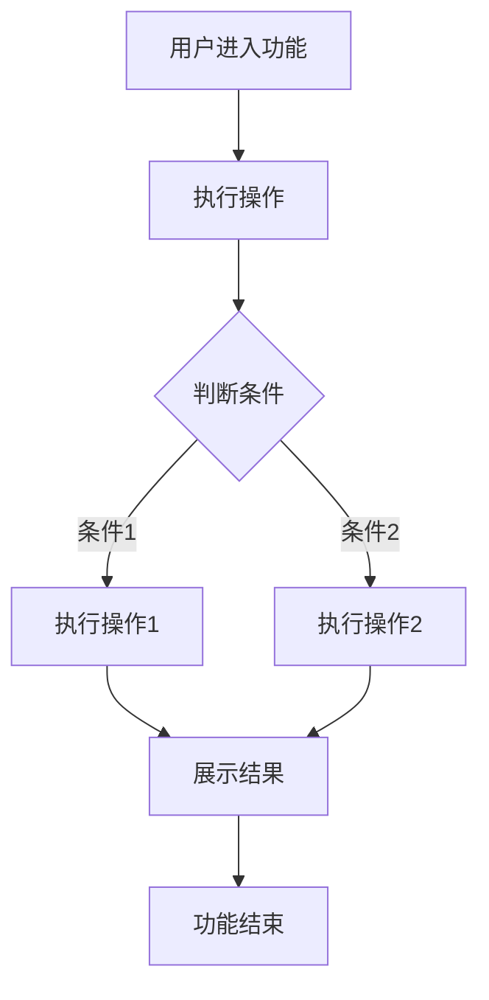
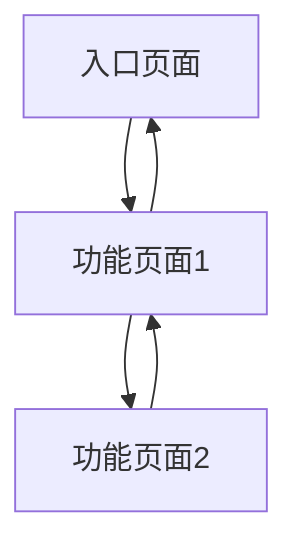
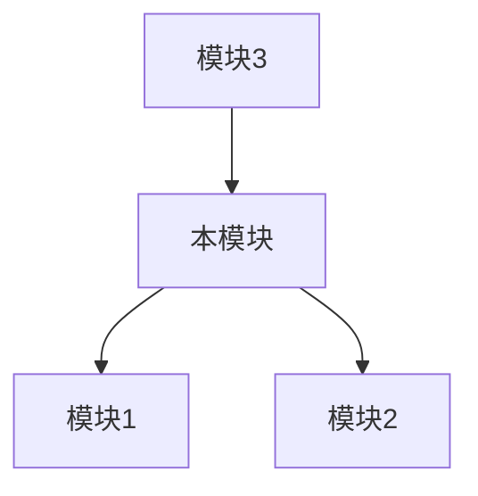
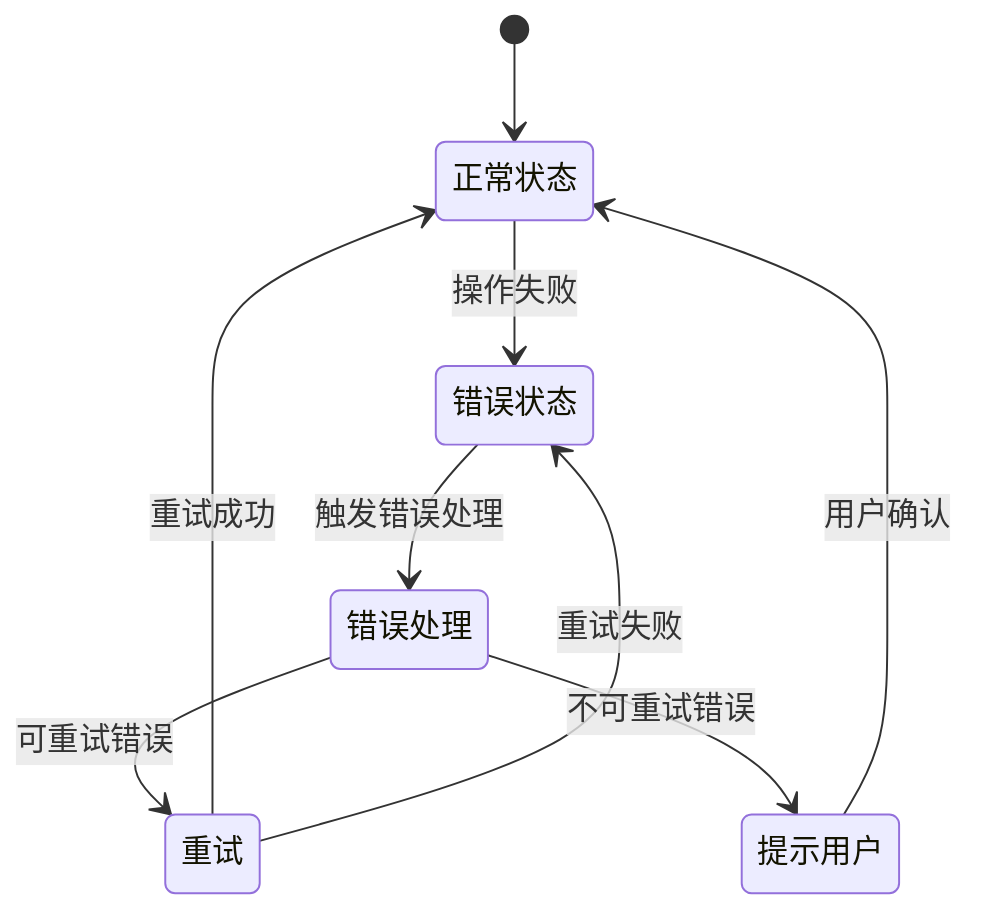

# {{模块名称}} 产品需求文档 (PRD)

> **模板版本:** 1.0
> **生成时间:** {{DATE}}
> **状态:** {{状态：未评审/已评审}}
> **关联主PRD:** {{主PRD名称及版本}}

## 目录

1. [文档基础信息](#1-文档基础信息)
2. [模块背景与目标](#2-模块背景与目标)
3. [详细功能需求](#3-详细功能需求)
4. [用户故事详述](#4-用户故事详述)
5. [用户界面设计](#5-用户界面设计)
6. [业务规则与边界条件](#6-业务规则与边界条件)
7. [与其他模块的集成](#7-与其他模块的集成)
8. [异常与错误处理](#8-异常与错误处理)
9. [埋点与数据指标](#9-埋点与数据指标)
10. [模块级验收标准](#10-模块级验收标准)
11. [附录](#11-附录)

---

## 1. 文档基础信息

| 字段 | 内容 |
| --- | --- |
| 文档名称 | {{模块名称}} 产品需求文档 |
| 作者 | {{AUTHOR}} |
| 创建时间 | {{DATE}} |
| 当前版本 | v{{VERSION}} |
| 变更日志 | 见下方章节 |

### 1.1 变更日志

| 日期 | 版本 | 概述 | 作者 |
|------------|------|----------------|--------------|
| {{DATE}} | {{VERSION}} | 初始版本 | {{AUTHOR}} |
| | | | |

---

## 2. 模块背景与目标

### 2.1 模块背景

{{描述此功能模块的业务背景，引用主PRD中的相关内容，说明该模块在整个项目中的位置和作用。}}

### 2.2 模块目标

- {{目标 1: 模块实现的主要功能}}
- {{目标 2: 模块实现的次要功能}}
- {{目标 3: 模块对用户或业务的价值}}

---

## 3. 详细功能需求

### 3.1 功能清单

| 编号 | 功能名称 | 描述 | 备注 |
| --- | --- | --- | --- |
| F-01 | {{功能名称}} | {{功能详细描述}} | {{备注}} |
| F-02 | {{功能名称}} | {{功能详细描述}} | {{备注}} |
| F-03 | {{功能名称}} | {{功能详细描述}} | {{备注}} |

### 3.2 功能流程图

> **说明：** 使用Mermaid图展示此功能模块的详细流程。



### 3.3 功能详细说明

#### 功能点 1: {{功能名称}}
- **入口：** {{从哪进入此功能}}
- **权限：** {{谁能使用此功能}}
- **功能逻辑：**
  - {{点击→发生什么}}
  - {{加载→失败/成功怎么展示}}
  - {{边界：无数据、网络异常、重复操作}}
- **字段说明：**
  - {{字段1：说明}}
  - {{字段2：说明}}
- **交互规则：**
  - {{交互规则1}}
  - {{交互规则2}}

#### 功能点 2: {{功能名称}}

---

### 3.4 模块角色与权限

| 角色 | 描述 | 权限 |
| --- | --- | --- |
| {{角色1}} | {{角色描述}} | {{权限1、权限2}} |
| {{角色2}} | {{角色描述}} | {{权限1、权限2}} |

---

## 4. 用户故事详述

#### **US-1: [用户故事标题]**
- **作为** [用户角色]
- **我希望** [完成某项操作]
- **以便于** [实现某种价值/解决某个问题]

**前置条件**: [执行此功能需要满足的前提]

**操作流程**: [一步步描述用户成功路径下的操作与系统反馈]

**异常处理**: [各种可能出错的情况及系统行为]

**验收标准**:
- [场景1：期望的系统结果]
- [场景2：期望的系统结果]

---

#### **US-2: [用户故事标题]**

---

## 5. 用户界面设计


### 5.1 核心屏幕和视图

- {{屏幕 1: 例如，列表页}}
- {{屏幕 2: 例如，详情页}}
- {{屏幕 3: 例如，编辑页}}

### 5.2 页面流程图

> **说明：** 使用Mermaid图展示页面之间的导航流程。



### 5.3 页面说明与交互细节

#### 页面 1：{{页面名称}}
- **入口**：{{点击哪个按钮进入}}
- **字段说明**：
  - {{字段1：必填，格式要求}}
  - {{字段2：必填，格式要求}}
- **校验规则**：
  - {{实时校验规则}}
  - {{提交时校验规则}}
- **交互逻辑**：
  - {{点击按钮后的行为}}
  - {{加载数据后的展示}}
  - {{边界条件：无数据、网络异常、重复操作}}
  - {{特殊情况处理：如用户未登录、数据加载失败等}}

#### 界面布局图

> **说明：** 使用ASCII图展示页面布局。

```text
+----------------------------------------+
|              页面标题                   |
+----------------------------------------+
|                                        |
|  +--------------+  +----------------+  |
|  |              |  |                |  |
|  |  左侧区域    |  |   右侧区域     |  |
|  |              |  |                |  |
|  +--------------+  +----------------+  |
|                                        |
|  +----------------------------------+  |
|  |            操作按钮区             |  |
|  +----------------------------------+  |
+----------------------------------------+
```

#### 页面 2：{{页面名称}}

---

## 6. 业务规则与边界条件

| 编号 | 规则描述 | 适用场景 | 备注 |
| --- | --- | --- | --- |
| R01 | {{规则描述}} | {{适用场景}} | {{备注}} |
| R02 | {{规则描述}} | {{适用场景}} | {{备注}} |
| R03 | {{规则描述}} | {{适用场景}} | {{备注}} |

### 6.1 边界条件

- {{边界条件1：如数据量限制、操作频率限制等}}
- {{边界条件2：如权限边界、功能边界等}}
- {{边界条件3：如异常情况下的处理策略}}

---

## 7. 与其他模块的集成

### 7.1 集成关系

| 模块名称 | 集成方式 | 数据流向 | 备注 |
| --- | --- | --- | --- |
| {{模块名称1}} | {{集成方式}} | {{数据流向}} | {{备注}} |
| {{模块名称2}} | {{集成方式}} | {{数据流向}} | {{备注}} |
| {{模块名称3}} | {{集成方式}} | {{数据流向}} | {{备注}} |

### 7.2 集成流程图

> **说明：** 使用Mermaid图展示与其他模块的集成流程。



---

## 8. 异常与错误处理

### 8.1 错误状态流转图

> **说明：** 使用Mermaid状态图展示错误处理的状态流转。



### 8.2 错误码表

> **说明：** 错误码应从标准错误码列表中选择，详见 [error_codes_reference.md](error_codes_reference.md)

| 错误码 | 错误信息 | 说明 |
| --- | --- | --- |
| 10001 | 参数无效：{具体参数说明} | {错误发生场景} |
| 20001 | 用户未登录 | {错误发生场景} |
| 50001 | 数据未找到：{具体数据说明} | {错误发生场景} |

---

## 9. 埋点与数据指标

| 埋点位置 | 埋点事件名 | 上报字段 |
| --- | --- | --- |
| {{页面/功能}} | {{事件名}} | {{上报字段}} |
| {{页面/功能}} | {{事件名}} | {{上报字段}} |
| {{页面/功能}} | {{事件名}} | {{上报字段}} |

---

## 10. 模块级验收标准

### 10.1 功能验收

- {{功能1：满足XXX条件算通过}}
- {{功能2：满足XXX条件算通过}}
- {{功能3：满足XXX条件算通过}}

### 10.2 界面验收

- {{界面1：符合设计稿}}
- {{界面2：符合设计稿}}
- {{响应式：在不同设备上显示正常}}

### 10.3 集成验收

- {{与模块1：集成正常}}
- {{与模块2：集成正常}}
- {{与模块3：集成正常}}

---

## 11. 附录

### 11.1 术语定义

| 术语 | 解释 |
| --- | --- |
| {{术语1}} | {{解释}} |
| {{术语2}} | {{解释}} |
| {{术语3}} | {{解释}} |

### 11.2 UI 设计图（如有）

{{设计图链接或截图}}
