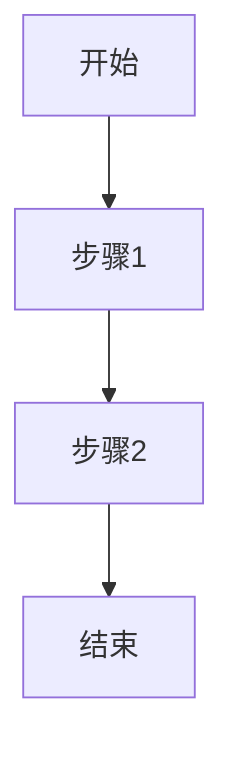

# XMind 内容解析文档

> 本文档由 XMind 文件解析生成，用于辅助生成主 PRD

## 一、原始内容解析

### 1.1 文件信息

| 项目 | 内容 |
|------|------|
| 源文件 | {{文件名}}.xmind |
| 解析时间 | {{时间}} |
| 根主题 | {{根主题}} |

### 1.2 完整节点内容

> 以下列出思维导图中所有节点的完整内容，包括标题、备注、标签等，确保不遗漏任何信息。

#### 层级结构

```
{{根主题}}
├── {{一级主题1}}
│   ├── {{二级主题1-1}}
│   │   └── {{三级主题1-1-1}}
│   └── {{二级主题1-2}}
├── {{一级主题2}}
│   ├── {{二级主题2-1}}
│   └── {{二级主题2-2}}
└── ...
```

#### 节点详情

{{按层级顺序，详细列出每个节点的完整信息：}}

**{{节点标题}}**
- 层级：{{层级深度}}
- 备注：{{备注内容，如有}}
- 标签：{{标签列表，如有}}
- 链接：{{外部链接，如有}}
- 子节点：{{列出子节点标题，如有}}

---

## 二、内容分析与总结

> 基于上述解析的全部内容，经过分析思考，总结以下关键信息：

### 2.1 功能概述

{{总结产品/项目的核心功能是什么，解决什么问题。基于所有节点内容综合分析得出。}}

### 2.2 使用人（用户角色）

{{总结产品的目标用户是谁，有哪些角色。基于所有节点内容综合分析得出。}}

| 角色 | 描述 | 权限/职责 |
|------|------|-----------|
| {{角色名}} | {{角色描述}} | {{权限或职责}} |

### 2.3 目标

{{总结产品/项目的目标是什么。基于所有节点内容综合分析得出。}}

- {{目标1}}
- {{目标2}}
- {{目标3}}

### 2.4 功能模块列表

{{基于所有节点内容综合分析，整理出功能模块列表。}}

| 编号 | 模块名称 | 描述 | 优先级 |
|------|----------|------|--------|
| M-01 | {{模块名}} | {{模块描述}} | {{高/中/低}} |
| M-02 | {{模块名}} | {{模块描述}} | {{高/中/低}} |

### 2.5 业务流程

{{基于所有节点内容综合分析，总结核心业务流程。可使用文字描述或 Mermaid 流程图。}}

#### 核心流程描述

{{文字描述核心业务流程}}

#### 流程图（可选）



---

*本文档由 XMind MCP 解析生成，请审核确认后继续生成 PRD*
