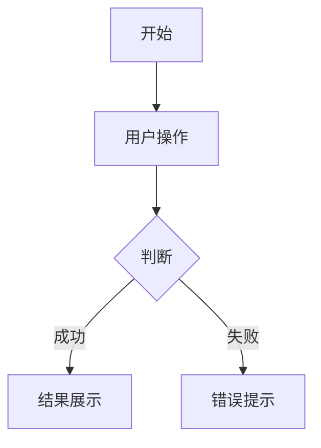

# 原型生成提示词模板

## 模板说明

此模板用于将 PRD 文档内容转换为现代前端项目结构。

## 技术栈

- **构建工具**：Vite
- **前端框架**：React 18
- **UI 框架**：
  - Web 端：Ant Design 5.x
  - 移动端：Ant Design Mobile 5.x
- **图表库**：Ant Design Charts
- **图标库**：lucide-react
- **路由**：React Router 6

## 输出要求

### 项目结构

```
prototype/
├── public/
├── src/
│   ├── components/          # 通用组件
│   ├── pages/               # 页面组件
│   ├── layouts/             # 布局组件
│   ├── router/              # 路由配置
│   ├── styles/              # 样式文件
│   ├── utils/               # 工具函数
│   ├── App.jsx
│   └── main.jsx
├── package.json
└── vite.config.js
```

### 页面组件要求

1. **使用 Ant Design 组件**
   - 布局：Layout, Row, Col, Space
   - 导航：Menu, Breadcrumb, Tabs
   - 表单：Form, Input, Select, DatePicker, Button
   - 数据展示：Table, List, Card, Descriptions
   - 图表：Line, Column, Pie, Area (from @ant-design/charts)

2. **使用 lucide-react 图标**
   ```jsx
   import { Home, User, Settings, Search } from 'lucide-react';
   ```

3. **组件结构**
   ```jsx
   import React from 'react';
   import { Card } from 'antd';
   import { Home } from 'lucide-react';
   import './style.module.css';

   const PageName = () => {
     return (
       <div className="page-container">
         <Card>
           <Home size={24} />
         </Card>
       </div>
     );
   };

   export default PageName;
   ```

4. **交互实现**
   - 所有按钮可点击
   - 表单可提交
   - 列表可翻页
   - 图表可交互
   - 页面可导航

## 提示词结构

```markdown
# 原型生成需求

## 项目概述

**项目名称**：{{PROJECT_NAME}}
**项目背景**：{{BACKGROUND}}
**项目目标**：
{{#each OBJECTIVES}}
- {{this}}
{{/each}}

## 设计规范

**主题色**：{{PRIMARY_COLOR}}
**设计风格**：{{DESIGN_STYLE}}

## 用户角色

| 角色名称 | 描述 | 权限 |
|---------|------|------|
{{#each USER_ROLES}}
| {{name}} | {{description}} | {{permissions}} |
{{/each}}

## 功能模块

### 模块关系图

{{MODULE_RELATIONSHIP_DIAGRAM}}

### 模块列表

| 编号 | 模块名称 | 描述 | 优先级 |
|------|---------|------|--------|
{{#each MODULES}}
| {{id}} | {{name}} | {{description}} | {{priority}} |
{{/each}}

## 界面设计需求

{{#each MODULES}}

### 模块 {{id}}：{{name}}

**模块目标**：{{module_goal}}

#### 功能清单

| 编号 | 功能名称 | 描述 |
|------|---------|------|
{{#each features}}
| {{id}} | {{name}} | {{description}} |
{{/each}}

#### 页面设计

{{#each pages}}

##### 页面：{{page_name}}

**入口**：{{entry_point}}
**权限**：{{permission}}

**布局描述**：
{{layout_description}}

**字段说明**：
{{#each fields}}
- **{{name}}**：{{description}}（{{required}}，格式：{{format}}）
{{/each}}

**校验规则**：
{{#each validation_rules}}
- {{rule}}
{{/each}}

**交互逻辑**：
{{#each interaction_logic}}
- {{logic}}
{{/each}}

**边界条件**：
{{#each boundary_conditions}}
- {{condition}}
{{/each}}

{{/each}}

#### 用户故事

{{#each user_stories}}

**US-{{id}}：{{title}}**
- 作为 {{role}}
- 我希望 {{action}}
- 以便于 {{value}}

**前置条件**：{{precondition}}
**操作流程**：{{operation_flow}}
**异常处理**：{{exception_handling}}
**验收标准**：
{{#each acceptance_criteria}}
- {{criterion}}
{{/each}}

{{/each}}

{{/each}}

## 业务流程

{{#each BUSINESS_FLOWS}}

### {{flow_name}}

{{flow_description}}

**流程图**：
{{flow_diagram}}

{{/each}}

## 业务规则

| 编号 | 规则描述 | 适用场景 |
|------|---------|---------|
{{#each BUSINESS_RULES}}
| {{id}} | {{description}} | {{scenario}} |
{{/each}}

## 技术实现要求

### 依赖安装

```bash
# Web 端
npm install antd @ant-design/charts lucide-react react-router-dom axios dayjs

# 移动端
npm install antd-mobile @ant-design/charts lucide-react react-router-dom axios dayjs
```

### 主题配置

```jsx
// src/App.jsx
import { ConfigProvider } from 'antd';

const theme = {
  token: {
    colorPrimary: '{{PRIMARY_COLOR}}',
    borderRadius: 6,
  },
};

const App = () => (
  <ConfigProvider theme={theme}>
    {/* 应用内容 */}
  </ConfigProvider>
);
```

### 路由配置

```jsx
// src/router/index.jsx
import { createBrowserRouter } from 'react-router-dom';

const router = createBrowserRouter([
  {
    path: '/',
    element: <MainLayout />,
    children: [
      { index: true, element: <Home /> },
      // ... 其他路由
    ],
  },
]);

export default router;
```
```

## 变量说明

### 项目级变量

| 变量名 | 来源 | 说明 |
|--------|------|------|
| PROJECT_NAME | 主 PRD - 文档基础信息 | 项目名称 |
| BACKGROUND | 主 PRD - 项目背景与目标 | 项目背景说明 |
| OBJECTIVES | 主 PRD - 项目背景与目标 | 产品目标列表 |
| USER_ROLES | 主 PRD - 用户故事概述 | 用户角色与权限 |
| MODULES | 主 PRD - 功能模块清单 | 功能模块列表 |
| MODULE_RELATIONSHIP_DIAGRAM | 主 PRD - 功能模块清单 | 模块关系 Mermaid 图 |
| BUSINESS_FLOWS | 主 PRD - 核心业务流程 | 业务流程列表 |
| BUSINESS_RULES | 模块 PRD - 业务规则 | 业务规则表 |
| PRIMARY_COLOR | frontend-design skill | 主题色 |
| DESIGN_STYLE | frontend-design skill | 设计风格 |

### 模块级变量

| 变量名 | 来源 | 说明 |
|--------|------|------|
| module_goal | 模块 PRD - 模块背景与目标 | 模块目标 |
| features | 模块 PRD - 详细功能需求 | 功能清单 |
| pages | 模块 PRD - 用户界面设计 | 页面列表 |
| user_stories | 模块 PRD - 用户故事详述 | 用户故事列表 |

### 页面级变量

| 变量名 | 来源 | 说明 |
|--------|------|------|
| page_name | 模块 PRD - 用户界面设计 | 页面名称 |
| entry_point | 模块 PRD - 用户界面设计 | 页面入口 |
| permission | 模块 PRD - 用户界面设计 | 访问权限 |
| layout_description | 模块 PRD - 用户界面设计 | 布局描述（从 ASCII 图转换） |
| fields | 模块 PRD - 用户界面设计 | 字段列表 |
| validation_rules | 模块 PRD - 用户界面设计 | 校验规则 |
| interaction_logic | 模块 PRD - 用户界面设计 | 交互逻辑 |
| boundary_conditions | 模块 PRD - 用户界面设计 | 边界条件 |

## 转换规则

### ASCII 布局图转换

将 ASCII 布局图转换为 Ant Design 布局组件：

**原始 ASCII 图：**
```
+----------------------------------------+
|              页面标题                   |
+----------------------------------------+
|                                        |
|  +--------------+  +----------------+  |
|  |              |  |                |  |
|  |  左侧区域    |  |   右侧区域     |  |
|  |              |  |                |  |
|  +--------------+  +----------------+  |
|                                        |
|  +----------------------------------+  |
|  |            操作按钮区             |  |
|  +----------------------------------+  |
+----------------------------------------+
```

**转换后的代码：**
```jsx
<div className="page-container">
  <div className="page-header">
    <h1>页面标题</h1>
  </div>
  <Row gutter={16}>
    <Col span={10}>
      <Card>左侧区域</Card>
    </Col>
    <Col span={14}>
      <Card>右侧区域</Card>
    </Col>
  </Row>
  <div className="page-footer">
    <Space>
      <Button type="primary">确定</Button>
      <Button>取消</Button>
    </Space>
  </div>
</div>
```

### Mermaid 流程图转换

将 Mermaid 流程图转换为交互逻辑：

**原始 Mermaid 图：**


**转换后的逻辑：**
```jsx
const handleSubmit = async () => {
  try {
    const result = await submitForm();
    message.success('操作成功');
    navigate('/success');
  } catch (error) {
    message.error(error.message);
  }
};
```

### 用户故事转换

将用户故事转换为组件和交互：

**原始用户故事：**
```
US-1: 用户登录
- 作为 用户
- 我希望 使用账号密码登录
- 以便于 访问系统功能

前置条件：用户已注册
操作流程：输入账号密码 -> 点击登录 -> 验证成功 -> 进入首页
异常处理：账号或密码错误 -> 显示错误提示
验收标准：
- 正确账号密码可成功登录
- 错误账号密码显示错误提示
```

**转换后的组件：**
```jsx
import React from 'react';
import { Form, Input, Button, message } from 'antd';
import { useNavigate } from 'react-router-dom';
import { LogIn } from 'lucide-react';

const LoginForm = () => {
  const [form] = Form.useForm();
  const navigate = useNavigate();

  const handleSubmit = async (values) => {
    try {
      // 登录逻辑
      message.success('登录成功');
      navigate('/');
    } catch (error) {
      message.error('账号或密码错误');
    }
  };

  return (
    <Form form={form} onFinish={handleSubmit}>
      <Form.Item name="username" rules={[{ required: true }]}>
        <Input placeholder="账号" />
      </Form.Item>
      <Form.Item name="password" rules={[{ required: true }]}>
        <Input.Password placeholder="密码" />
      </Form.Item>
      <Button type="primary" htmlType="submit" icon={<LogIn size={16} />}>
        登录
      </Button>
    </Form>
  );
};

export default LoginForm;
```
