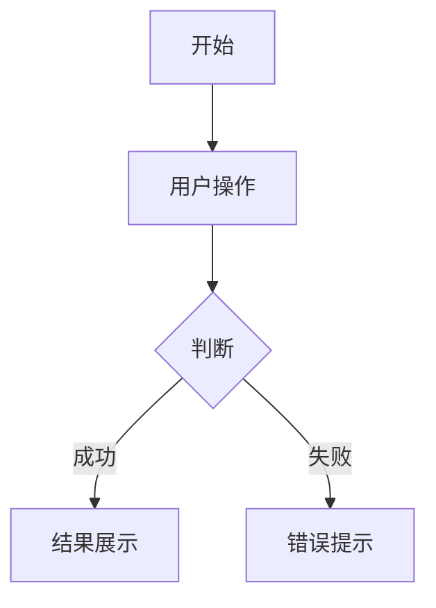

# 原型生成提示词模板

## 模板说明

此模板用于将 PRD 文档内容转换为 frontend-design skill 可理解的格式。

## 提示词结构

```markdown
# 原型生成需求

## 项目概述

**项目名称**：{{PROJECT_NAME}}
**项目背景**：{{BACKGROUND}}
**项目目标**：
{{#each OBJECTIVES}}
- {{this}}
{{/each}}

## 用户角色

| 角色名称 | 描述 | 权限 |
|---------|------|------|
{{#each USER_ROLES}}
| {{name}} | {{description}} | {{permissions}} |
{{/each}}

## 功能模块

### 模块关系图

{{MODULE_RELATIONSHIP_DIAGRAM}}

### 模块列表

| 编号 | 模块名称 | 描述 | 优先级 |
|------|---------|------|--------|
{{#each MODULES}}
| {{id}} | {{name}} | {{description}} | {{priority}} |
{{/each}}

## 界面设计需求

{{#each MODULES}}

### 模块 {{id}}：{{name}}

**模块目标**：{{module_goal}}

#### 功能清单

| 编号 | 功能名称 | 描述 |
|------|---------|------|
{{#each features}}
| {{id}} | {{name}} | {{description}} |
{{/each}}

#### 页面设计

{{#each pages}}

##### 页面：{{page_name}}

**入口**：{{entry_point}}
**权限**：{{permission}}

**布局描述**：
{{layout_description}}

**字段说明**：
{{#each fields}}
- **{{name}}**：{{description}}（{{required}}，格式：{{format}}）
{{/each}}

**校验规则**：
{{#each validation_rules}}
- {{rule}}
{{/each}}

**交互逻辑**：
{{#each interaction_logic}}
- {{logic}}
{{/each}}

**边界条件**：
{{#each boundary_conditions}}
- {{condition}}
{{/each}}

{{/each}}

#### 用户故事

{{#each user_stories}}

**US-{{id}}：{{title}}**
- 作为 {{role}}
- 我希望 {{action}}
- 以便于 {{value}}

**前置条件**：{{precondition}}
**操作流程**：{{operation_flow}}
**异常处理**：{{exception_handling}}
**验收标准**：
{{#each acceptance_criteria}}
- {{criterion}}
{{/each}}

{{/each}}

{{/each}}

## 业务流程

{{#each BUSINESS_FLOWS}}

### {{flow_name}}

{{flow_description}}

**流程图**：
{{flow_diagram}}

{{/each}}

## 业务规则

| 编号 | 规则描述 | 适用场景 |
|------|---------|---------|
{{#each BUSINESS_RULES}}
| {{id}} | {{description}} | {{scenario}} |
{{/each}}

## 样式要求

### 整体风格
- **设计风格**：{{design_style}}
- **主色调**：{{primary_color}}
- **辅助色**：{{secondary_color}}

### 响应式要求
- **桌面端**：{{desktop_requirement}}
- **平板端**：{{tablet_requirement}}
- **移动端**：{{mobile_requirement}}

### 交互反馈
- **加载状态**：{{loading_state}}
- **成功提示**：{{success_message}}
- **错误提示**：{{error_message}}

## 技术要求

### 浏览器兼容性
{{#each BROWSER_COMPATIBILITY}}
- {{browser}}：{{version}}
{{/each}}

### 性能要求
- **页面加载时间**：{{page_load_time}}
- **接口响应时间**：{{api_response_time}}

## 输出要求

请生成以下文件：
1. `index.html` - 主入口文件
2. `css/style.css` - 样式文件
3. `js/main.js` - 交互脚本
4. `assets/` - 资源文件夹

### 页面要求
- 使用语义化 HTML 标签
- CSS 采用 BEM 命名规范
- JavaScript 实现基本交互功能
- 支持响应式布局
- 包含必要的动画效果

### 交互要求
- 所有按钮可点击
- 表单可提交
- 页面可导航
- 支持基本的数据展示
```

## 变量说明

### 项目级变量

| 变量名 | 来源 | 说明 |
|--------|------|------|
| PROJECT_NAME | 主 PRD - 文档基础信息 | 项目名称 |
| BACKGROUND | 主 PRD - 项目背景与目标 | 项目背景说明 |
| OBJECTIVES | 主 PRD - 项目背景与目标 | 产品目标列表 |
| USER_ROLES | 主 PRD - 用户故事概述 | 用户角色与权限 |
| MODULES | 主 PRD - 功能模块清单 | 功能模块列表 |
| MODULE_RELATIONSHIP_DIAGRAM | 主 PRD - 功能模块清单 | 模块关系 Mermaid 图 |
| BUSINESS_FLOWS | 主 PRD - 核心业务流程 | 业务流程列表 |
| BUSINESS_RULES | 模块 PRD - 业务规则 | 业务规则表 |

### 模块级变量

| 变量名 | 来源 | 说明 |
|--------|------|------|
| module_goal | 模块 PRD - 模块背景与目标 | 模块目标 |
| features | 模块 PRD - 详细功能需求 | 功能清单 |
| pages | 模块 PRD - 用户界面设计 | 页面列表 |
| user_stories | 模块 PRD - 用户故事详述 | 用户故事列表 |

### 页面级变量

| 变量名 | 来源 | 说明 |
|--------|------|------|
| page_name | 模块 PRD - 用户界面设计 | 页面名称 |
| entry_point | 模块 PRD - 用户界面设计 | 页面入口 |
| permission | 模块 PRD - 用户界面设计 | 访问权限 |
| layout_description | 模块 PRD - 用户界面设计 | 布局描述（从 ASCII 图转换） |
| fields | 模块 PRD - 用户界面设计 | 字段列表 |
| validation_rules | 模块 PRD - 用户界面设计 | 校验规则 |
| interaction_logic | 模块 PRD - 用户界面设计 | 交互逻辑 |
| boundary_conditions | 模块 PRD - 用户界面设计 | 边界条件 |

## 转换规则

### ASCII 布局图转换

将 ASCII 布局图转换为文字描述：

**原始 ASCII 图：**
```
+----------------------------------------+
|              页面标题                   |
+----------------------------------------+
|                                        |
|  +--------------+  +----------------+  |
|  |              |  |                |  |
|  |  左侧区域    |  |   右侧区域     |  |
|  |              |  |                |  |
|  +--------------+  +----------------+  |
|                                        |
|  +----------------------------------+  |
|  |            操作按钮区             |  |
|  +----------------------------------+  |
+----------------------------------------+
```

**转换后的描述：**
```
页面采用上下布局：
- 顶部：页面标题区域，居中显示
- 中部：左右分栏布局
  - 左侧区域：占页面宽度的 40%
  - 右侧区域：占页面宽度的 60%
- 底部：操作按钮区域，居中显示
```

### Mermaid 流程图转换

将 Mermaid 流程图转换为文字描述：

**原始 Mermaid 图：**


**转换后的描述：**
```
流程说明：
1. 用户开始操作
2. 执行用户操作
3. 进行条件判断
   - 成功：展示结果
   - 失败：显示错误提示
```

### 用户故事转换

将用户故事转换为交互需求：

**原始用户故事：**
```
US-1: 用户登录
- 作为 用户
- 我希望 使用账号密码登录
- 以便于 访问系统功能

前置条件：用户已注册
操作流程：输入账号密码 -> 点击登录 -> 验证成功 -> 进入首页
异常处理：账号或密码错误 -> 显示错误提示
验收标准：
- 正确账号密码可成功登录
- 错误账号密码显示错误提示
```

**转换后的交互需求：**
```
登录功能：
- 页面元素：账号输入框、密码输入框、登录按钮
- 交互流程：
  1. 用户输入账号和密码
  2. 点击登录按钮
  3. 验证账号密码
  4. 成功：跳转到首页
  5. 失败：显示错误提示
- 验证规则：
  - 账号：必填，邮箱格式
  - 密码：必填，至少6位
```

## 使用示例

### 输入（PRD 内容）

```markdown
# 电商平台 产品需求文档

## 项目背景与目标

### 背景说明
打造一个面向年轻用户的电商平台...

### 产品目标
- 提供便捷的购物体验
- 支持多种支付方式
- 实现个性化推荐

## 功能模块清单

| 编号 | 模块名称 | 描述 | 优先级 |
|------|---------|------|--------|
| M-01 | 用户管理 | 用户注册、登录、个人信息管理 | 高 |
| M-02 | 商品管理 | 商品展示、搜索、分类 | 高 |
| M-03 | 购物车 | 商品加入购物车、数量修改 | 高 |
```

### 输出（提示词）

```markdown
# 原型生成需求

## 项目概述

**项目名称**：电商平台
**项目背景**：打造一个面向年轻用户的电商平台...
**项目目标**：
- 提供便捷的购物体验
- 支持多种支付方式
- 实现个性化推荐

## 功能模块

| 编号 | 模块名称 | 描述 | 优先级 |
|------|---------|------|--------|
| M-01 | 用户管理 | 用户注册、登录、个人信息管理 | 高 |
| M-02 | 商品管理 | 商品展示、搜索、分类 | 高 |
| M-03 | 购物车 | 商品加入购物车、数量修改 | 高 |

...（后续内容）
```
